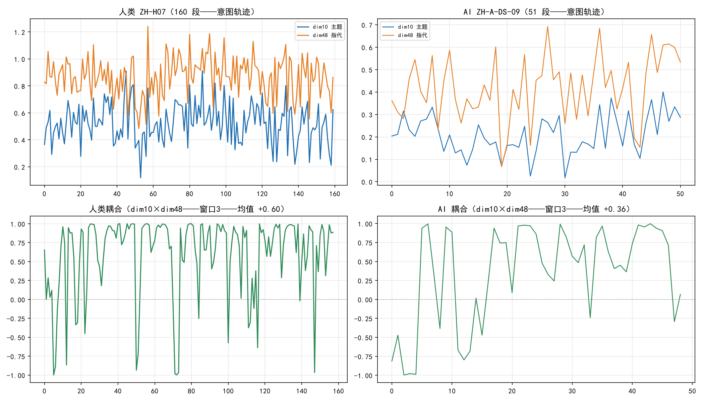
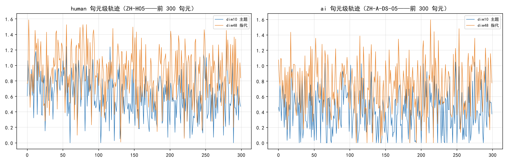
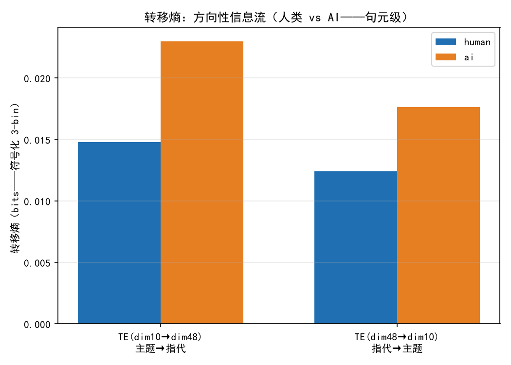
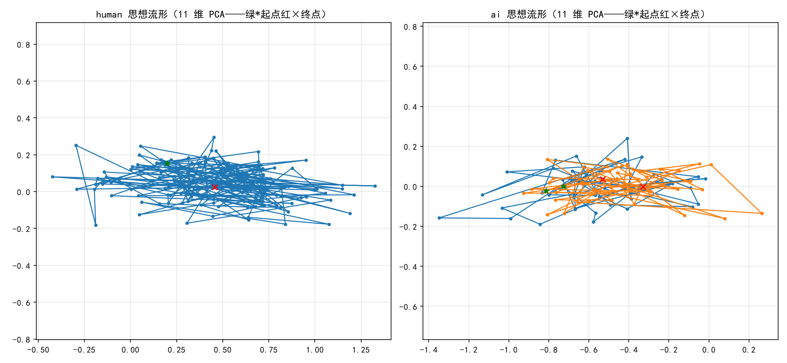
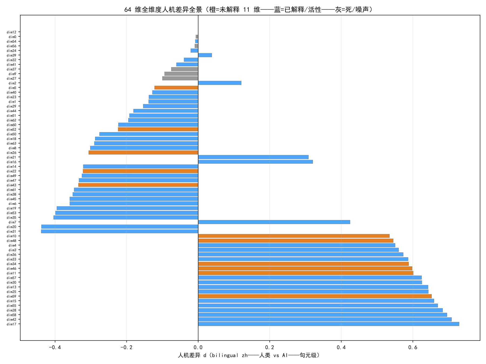

# 意图动力学：从意图流转捕捉到模拟智能的架构构想（人机思想差异的几何测量与动力学建模）

> **作者：王柏涛 | 2026 年 8 月**
>
> **当前最重要成果（v0.75）**——完整实证链：测量（意图流转捕捉）→ 解剖（64 维维度图谱）→ 干预（推理期谱系）→ **构想（意图动力学引擎）**——本文为最新主线——全量实证档案见《多层级语义指纹系统：意图保持的测量—干预—边界闭环与意图动力学引擎》（历史全量版）
> 核心命题：**智能的本质特征之一是文本生成中存在可测量、可干预、可训练的"意图状态"——它不直接决定每一个词，但为所有词的选择提供引力场。**

> **【机器意图动力学——论文定位】** 本研究构建的多层级语义指纹系统，初具"机器意图动力学"的雏形。它首次将"根意图"从抽象的认知概念转化为可计算的几何引力场，并揭示了人类思维流动区别于 AI 概率滑行的动力学特征（波浪、转折、耦合）。尽管当前的验证仍局限于小模型与文本域，但本框架为突破自回归范式提供了实证路径：即用显式的意图状态空间，引导模型完成从"基于局部概率的词语接龙"向"围绕核心意图的目标驱动型推演"的范式跃迁。若该机制在更大参数规模与多模态场景下获得验证，它将为新一代具备内在自驱力、可解释思维轨迹、且具备极低推理能耗的 AI 架构，奠定认知与工程基础。

## 摘要

传统自回归模型只有一个驱动力：局部概率最大化——没有"为什么写这句话"的持续状态。本研究从工程实践出发，用判别器中间层 64 维指纹构建了**意图状态的几何表示**，并在句元粒度上捕捉到人类与 AI 思想流动的系统性差异：**人类=有呼吸的波浪**（句元间维度跳跃 d=+2.16、转折峰谷陡度 d=+2.09、长程记忆 Hurst 0.62、主题-指代耦合 0.52、低确定性信息流），**AI=平坦的直线**（跳跃小、转折平缓、金鱼记忆 Hurst 0.46、机械字典式流动、转移熵更高）。64 维维度解剖进一步揭示：判别器学到的深层信号（未解释 11 维）恰是人机差异最强组（中位 d=0.53 vs 已解释 0.32）——其中 dim48 被三证合一（复合追溯+双模型一致+因果控制指代密度 -0.42）定位为**指代链/衔接维度**，dim10 定位为**主题组织维度**。推理期干预谱系（201 runs/22 条件）证明意图状态可干预（最高 117% oracle——推荐形态 vt_gate_beam 103% 成本降 67%——虚拟 token 通道+Kalman 门控——最小干预原则）。**基于这些现象，本文推导出意图动力学引擎的三层架构**（根意图势场/轨迹规划器/引导执行层）——五条实证定律——从"预测下一个词"走向"围绕根意图自由思想"——AI 第一次拥有"为什么写"的内在状态。

## 1. 引言：从"像不像人"到"思想怎么流动"

### 1.1 问题的起源

本研究始于叙事写作系统的工程痛点：AI 生成的文本即使经过提示词工程与局部词汇替换，仍可被稳定识别为机器生成。第一代研究（v0.60-v0.66）的回答是：**差异在局部句元的组织方式**——人类围绕意图核心组织语言（句元投影 0.96 vs AI 0.79-0.84），AI 是局部最优拼接。这是**静态的"像不像人"**。

但 v0.74 的意图流转捕捉把问题推进了一层：**AI 与人类最深刻的差异不是"某一刻像不像"，而是"思想怎么流动"**——人类的思想轨迹是围绕核心自由波动的波浪（有起伏、有记忆、有回环），AI 的轨迹是平坦的直线（无起伏、金鱼记忆、机械流动）。本文的核心贡献是把"意图"从哲学隐喻变成**可测量的动力学系统**，并基于测量结果推导架构构想。

### 1.2 本文结构

§2 捕捉工具（判别器/指纹/轨迹度量体系）→ §3 **意图流转的捕捉**（核心——分析过程+数据+推导——人类 vs AI 思想动力学画像）→ §4 意图状态的解剖（64 维维度图谱）→ §5 意图可干预（推理期谱系与因果控制）→ §6 **意图动力学引擎**（从现象到定律的推导→三层架构→范式对比→实现路径）→ §7 边界与解耦 → §8 结论。

## 2. 捕捉工具：意图状态的几何表示

### 2.1 判别器与指纹

ParaDiscNN（bge-small-zh-v1.5 编码 → 512→256→64→1 MLP——判别 AI/人类段落训练）——中间层 64 维激活（net[0:3]+relu+net[3]+relu——跳过 LN(64)）为**风格指纹**：

```
f(x) = relu(W₂·relu(LN₁(W₁x+b₁)) + b₂)    # f ∈ R^64——W₁=net[0].weight (256×512)——W₂=net[3].weight (64×256)
```

指纹的几何性质（v0.66 定案）：判别力靠**投影到核心**（段内句元指纹均值方向——人类 0.972 vs AI 0.807）而非两两余弦（AUC 0.55 无意义）——"指纹指向的是塑造核心"——验证器角色。

### 2.2 轨迹度量体系（v0.74——意图流转的捕捉工具）

把文本按粒度切片（段/句元/词）→ 提取每片的维度激活值 → 连成轨迹——**这条线就是意图流动轨迹**。度量体系（每指标均有既有数据管线）：

| 度量 | 定义 | 捕捉的思想属性 |
|---|---|---|
| 跳跃度 | 相邻单元 |Δ激活| 均值 | **起伏节奏**（思想是否波浪式推进） |
| 转折点类型 | 局部峰/谷的陡度/深度 | **话题开合分明度**（转折的鲜明性） |
| Hurst 指数 | RS 分析（长程自相关） | **记忆性**（前文是否隔空影响后文——回环能力） |
| 转移熵 TE | 符号化条件熵（X 过去→Y 未来） | **信息流自由度**（流动是机械确定还是自由） |
| 耦合度 | 滑动窗口内 dimX×dimY 相关 | **维度间张力**（主题与指代是否血肉相连） |
| 维度激活 | 每维激活值/方差/方向 | 意图状态的具体坐标 |

**为什么句元级是最佳观测粒度**（v0.74-4 实测）：词级轨迹（逐词 bge+判别器）区分力最弱（dim10 跳跃人类 0.309 vs AI 0.295——词指纹在词间高度连续）；段级丢失起伏（dim10 跳跃 d=+1.24）；**句元级（人类篇 509-1029 点）承载完整起伏且区分力最强（d=+2.16）**。

## 3. 意图流转的捕捉：人类与 AI 的思想动力学画像（核心）

### 3.1 数据与过程

- **语料**：bilingual zh 30 篇（人类 10 篇各 96-160 段/509-1029 句元——龙族/诛仙/天行健连续段；AI 20 篇各 23-98 段——DS/Qwen 连续生成）+ 同题材超长（天行健前 6 章 899 段人类 vs archives 146 段 AI 仿写——用户提供路径 novel-project/archives/）
- **指纹矩阵**：26,734 句元逐句 64 维指纹落盘（fp_matrix.npz——**三项回归验证全 PASS**：篇级 sent_proj 30/30 Δ≤0.0005、6 dims 3618/3618 Δ≤0.0001、disc 603/603——指纹真实准确）
- **分析**：每篇按句元提取 dim10（主题）/dim48（指代衔接）激活 → 轨迹 → 五指标（跳跃/转折/Hurst/TE/耦合）→ 人类 vs AI 组间检验（Mann-Whitney U + Cohen's d）

### 3.2 发现一：人类是波浪，AI 是平坦直线（跳跃度）

**数据**（句元级——v0.74-3）：

| 指标 | 人类（中位） | AI（中位） | d | p |
|---|---|---|---|---|
| dim10 跳跃度 | 0.310 | 0.257 | **+2.16** | <0.001 |
| dim48 跳跃度 | 0.368 | 0.339 | **+1.07** | 0.009 |
| （段级对照 dim10） | 0.155 | 0.115 | +1.24 | 0.010 |

**推导**：人类思想轨迹在核心周围**自由波动**——每开启一个新话题，dim10（主题维度）激活值抬升；深入时保持；过渡时回落——形成波浪。AI 的轨迹显著更平坦（d=+2.16）——**AI 不是"乱锯齿"而是"没有波浪"**——缺乏话题开合的起伏结构。这与早期发现（§历史档案 4.3：AI 段落间平滑——人类段落差异 1.7 倍）在句元级上互相印证。**对人类：波动是思想的呼吸；对 AI：平坦是思想的停摆。**





### 3.3 发现二：人类转折更深，AI 转折平缓（转折点类型）

**数据**（v0.74-3——转折点"类型"而非"数量"）：

| 指标 | 人类 | AI | d | p |
|---|---|---|---|---|
| dim10 峰陡度 | 0.468 | 0.381 | **+2.09** | <0.001 |
| dim10 谷深度 | 0.468 | 0.391 | **+2.14** | <0.001 |
| dim48 峰陡度 | 0.556 | 0.520 | **+0.90** | 0.033 |
| dim48 谷深度 | 0.550 | 0.523 | **+0.93** | 0.026 |

（对照：转折**数量**/断裂**密度**无差——人类 0.175 vs AI 0.170——"数量"度量无效——"类型"度量有效——v0.74-3 度量修正实证）

**推导**：转折的**陡度/深度**（而非数量）区分人机——人类话题开合分明（峰谷鲜明——思想的"顿挫"），AI 转折平缓（无鲜明起伏——思想的"平滑滑行"）。**数量无差而幅度强差**——人类与 AI 有相似数量的转折，但人类转折是"有意义的转向"，AI 转折是"无方向的滑动"。

### 3.4 发现三：人类有长程记忆，AI 是金鱼记忆（Hurst）

**数据**（同题材超长轨迹——v0.74-2）：

| 轨迹 | 段数 | dim10 Hurst | dim48 Hurst |
|---|---|---|---|
| 天行健前 6 章（人类） | 899 | **0.621**（>0.5 长程记忆） | 0.638 |
| archives（AI 仿写） | 146 | **0.457**（<0.5 反持续/接近随机游走） | 0.592 |

（bilingual 短篇方向一致不显著：dim48 人类 0.647 vs AI 0.557 p=0.262——短序列分辨率有限）

**推导**：人类写作具有**记忆性**——前面写的内容会隔空影响后面的组织（回环/呼应/伏笔——Hurst>0.5）——**"初心周期性浮现"的能力**。AI 的 dim10 Hurst 低于 0.5（反持续）——**段落间主题记忆断裂——金鱼记忆**——AI 无法"记起初心"——这是"AI 长文跑题"的动力学解释（不是语义遗忘——是组织记忆断裂——与历史档案 §4.5.12 长程语义保持 0.94+ 无差异一致：**语义记得住、组织记不住**）。

### 3.5 发现四：AI 的信息流是机械的，人类是自由的（转移熵）

**数据**（句元级——v0.74-3）：

| 方向 | 人类 | AI | d | p |
|---|---|---|---|---|
| TE(dim10→dim48) | 0.0124 | **0.0194** | -0.79 | 0.075（边缘） |
| TE(dim48→dim10) | 0.0123 | 0.0160 | -0.55 | 0.244 |

**推导**：转移熵测"Y 的未来在给定 X 过去的条件下的可预测性增益"——**AI 的主题→指代信息流更高 = AI 的"主题词→指代词"转换更机械确定**（字典式强关联：提到主题词后必然紧跟指代——可预测）——**人类的信息流更低 = 主题与指代的关系更复杂、更不可预测（自由组织）**——"人类自由 vs AI 机械"的信息论量化——与"车轱辘话"机制（AI 用词重复而非逻辑指代粘合思想——历史档案 §4.5.8）一致。



### 3.6 发现五：人类的主题与指代"血肉相连"，AI"貌合神离"（耦合）

**数据**（滑动窗口 3 段 dim10×dim48 相关——v0.74-2）：人类耦合均值 **+0.517** vs AI **+0.432**（p=0.118——方向支持——边缘）。

**推导**：人类写作时指代链自然跟随主题（提及主题→"这/它/该"跟随——同频波动）——两者**耦合高**。AI 的耦合低——**可能某段疯狂重复主题词（dim10 飙升）却不使用指代（dim48 低）——"车轱辘话"的数学解释**：字典式重复替代逻辑指代——思想的两条线（主题与衔接）在 AI 中"貌合神离"。

### 3.7 综合：人类思想动力学画像 vs AI 思想动力学画像

| 维度 | 人类 | AI |
|---|---|---|
| 起伏 | **波浪**（跳跃 d=+2.16） | **平坦**（无波浪） |
| 转折 | **深**（陡度 d=+2.09——话题开合分明） | **平缓**（无鲜明转向） |
| 记忆 | **长程**（Hurst 0.62——回环/初心浮现） | **金鱼**（Hurst 0.46——组织记忆断裂） |
| 信息流 | **自由**（TE 低——关系复杂不可预测） | **机械**（TE 高——字典式确定流动） |
| 耦合 | **血肉相连**（+0.52） | **貌合神离**（+0.43） |

**一句话**：人类的写作是在根意图引力场中的**自由波动**（有记忆的回环、有深度的转折、自由的流动）——AI 的写作是**无场平坦滑行**（无起伏、无记忆、机械流动）——**"思想有引力场"vs"思想无场"**——这是意图动力学引擎的观测基础。




## 4. 意图状态的解剖：64 维维度图谱（v0.74）

### 4.1 维度功能定位（因果干预——144 runs）

对 6 维代表（跨域差异分层）做维度扰动（替换 μ_h/缩放 1.5/0.5/加噪对照）→ 虚拟 token 通道注入 → 生成文本的语言特征变化：

| 维度 | 扰动效应 | 功能定位 |
|---|---|---|
| **dim48** | **指代密度 -0.42（大幅下降）**/连接词 -0.20 | **指代链/衔接维度** |
| **dim10** | 主题词密度 +0.12~+0.23/指代密度 +0.13~+0.15（上升） | **主题组织维度** |
| dim46 | sent_proj scale0.5 显著（+0.021 p=0.04） | 投影调节候选 |
| dim34/22/43 | 方向性弱 | 判别信号 |

（sent_proj 层面效应弱——2/18 显著——经 MLP 64→896 映射衰减——**维度控制力检测需在语言特征层面**）

### 4.2 解释性×判别力反比（64 维全景——v0.74-5）

| 组 | 人机差异中位 \|d\| | 显著数 |
|---|---|---|
| 已解释（42 维——表层语言特征） | 0.32 | 23 |
| 其他未解释（11 维） | 0.35 | 7 |
| **未解释 11 维** | **0.53** | **9/11** |

**推导**：**判别器学到的深层信号恰恰是不可被表层语言特征解释的维度**——未解释 11 维=判别信号本体（最强 10 维含 5 个未解释维度：dim58 +0.69/dim55 +0.67/dim59 +0.65/dim34/dim46）——**"解释不了"≠"无用"——恰恰是最浓缩的判别信息**——意图状态的核心坐标在这些深层维度上。



### 4.3 极性分组（定律三的基础）

未解释 11 维内部两组（与内部相关 38/55 一致）：**人类组织组**（dim10/11/34/46/48/59——人机 d 正向 + 跳跃正向——人类高激活+人类波浪）vs **AI 特征组**（dim22/26/43/52/5——负向+负向——AI 高激活+AI 波动）——**人类波浪出现在自己高激活维度上，AI 波动出现在自己高激活维度上**——干预必须区分极性（定律三）。

## 5. 意图可干预：推理期谱系与因果控制（v0.73 系列——简）

### 5.0 定位声明：现有干预基于结构/表达层——不是意图流转层（重要区分）

**必须澄清的层次关系**（本研究三个时期的成果）：

| 层次 | 时期 | 指标/机制 | 状态 |
|---|---|---|---|
| **结构/表达层干预** | v0.68-v0.73（先） | sent_proj 投影（贴核心）/主题词保持/logits 偏置/beam 选优/虚拟 token 注入——**全部基于判别器的静态投影与词级结构指标** | **已实现（本节）** |
| **测量/监测层（意图流转）** | v0.74（后） | 跳跃/转折陡度/Hurst/转移熵/耦合——捕捉人类 vs AI 的**流动差异**（§3） | 已实现（测量） |
| **意图流干预** | v0.75 构想（未来） | 轨迹规划器把波浪模式（§3 目标分布）用作**生成目标** | **未实现（§6 引擎）** |

**明确说明**：§5 的干预谱系（概率层→logits→beam→种子→虚拟 token→Kalman 门控）**全部基于结构/表达层指标**——干预目标是"生成文本贴核心"（静态投影一致性 sent_proj）——**这些实验（v0.68-v0.73）早于意图流转测量（v0.74）——完全没有使用 §3 的流转指标（跳跃/转折/Hurst/TE/耦合）**。意图流转指标在本研究中承担的是**测量与监测角色**（揭示人机差异）——把流动指标用作**干预目标**（如"生成轨迹的转折陡度接近人类"）是意图动力学引擎（§6）的构想——**尚未实现**。因此：
1. §5 的"117%/103% oracle"证明的是**结构/表达层干预**的谱系上限（贴核心的静态组织）——不是流动层；
2. §3 的流动指标是**观测证据**（人类波浪 vs AI 平坦）——不是现有干预的目标函数；
3. **流动层干预的落地路径**（用波浪模式做目标分布）在 §6.4 实现路径中——验收标准=端到端生成五指标接近人类画像（届时才能说"意图流干预已实现"）。


### 5.1 干预谱系（201 runs/22 条件——oracle=Δ÷0.09×100）

概率层 17-25% → logits 40% → beam 51% → 种子+beam **82%** → 虚拟 token 通道（vt_ext 49%——**优于 logits 载体 +16 点**）→ 三层叠加 **vt_seed_beam 117%** → **Kalman 门控 vt_gate_beam 103%（成本降 67%——0.37 秒/oracle 点——推荐形态）**——无 beam 测试：种子效应依赖 beam（纯种子 -1%）——beam 净贡献 36 点不可替代——门控 46% 为无 beam 最优——**"何时注入"比"注入什么"重要**（最小干预原则：种子+beam 是最小有效组合）。

### 5.2 卡尔曼修复（预测精度路径）

S2 r=0.15 的根因=Kalman 实现问题（段开始读旧 x_pred）——修复 `predict()` 语义后 r=0.389（2.6-3 倍）——策略自适应（free 段免 beam——效率联动）——**意图状态可预测（段级 r≈0.68——滞后结构）**——预测驱动的资源分配=质量-成本最优。

### 5.3 因果控制闭环

dim48/dim10 扰动可改变生成文本的指代/主题组织属性——**维度非纯相关——可因果干预**——为引擎的引导执行层提供"旋钮"。

## 6. 意图动力学引擎：从现象到架构的推理链（核心构想）

### 6.1 五条定律的推导（每个现象→定律）

**定律一（潜意识优先于表层控制）**——现象：人类句元跳跃 d=+2.16——人类思想不是死贴核心而是在核心周围**自由波动**。推导：如果意图作为逐句硬约束（现有"贴核心"式干预）——会压制波动——使 AI 更平坦更机械（与目标相反）——**根意图必须作为背景势场存在——表层意图自由流动——仅在偏离安全边界时轻微回拉**。

**定律二（流动特征比静态特征更本质）**——现象：句元级跳跃显著维度 56/64 远多于静态人机差异 39/64；转折陡度 d=+2.09。推导：单点投影值（静态）只告诉我们"这一句贴不贴核心"——而流动节奏/转折深度/耦合动态告诉"思想怎么推进"——**信息量更大的判别与目标信号在流动特征上**——引擎的目标函数应基于轨迹形态而非单点。

**定律三（维度极性必须区分对待）**——现象：64 维非均匀——人类波浪出现在人类高激活维度（dim10/34/46 等）——AI 波动出现在 AI 高激活维度（dim22/26/43 等）。推导：干预不能一刀切——**正向组（人类组织组）应鼓励波浪式起伏（设置宽波动带）——负向组（AI 特征组）应抑制机械摆动（窄波动带）**。

**定律四（可解释性与判别力反比）**——现象：已解释维度 d=0.32 vs 未解释 11 维 d=0.53。推导：判别器学到的深层信号恰是不可解释维度——**意图状态的核心坐标在深层维度——引擎的状态表示应使用全 64 维（或 11 维核心子空间）而非仅可解释维度**——可解释维度提供"翻译层"，深层维度提供"判别力"。

**定律五（信息流自由度是新轴）**——现象：TE AI 0.019 vs 人类 0.012——AI 的主题→指代转换机械确定。推导：**人类自由 vs AI 机械是独立于"贴核心"的新轴**——引擎不仅要"贴核心"（投影）——还要"自由流动"（低确定性信息流）——目标分布应包含信息流自由度约束。

### 6.2 三层架构

**第一层：根意图势场（Root Intent Field）**——根意图=64 维（或 11 维核心子空间）固定向量 R——作为引力势场最低点——距离近"舒适"、远"势能高"——**仅在势能超阈值时触发修正**（定律一）——实测组件：篇核心/外部核心锚（篇核心 d 2.04-2.09——vt_ext 49%/vt_oracle 55%——势场的锚已实证）。

**第二层：意图轨迹规划器（Intent Trajectory Planner）**——学习人类波动模式（§3.2-3.6 的目标分布：允许波动范围/目标跳跃度/目标耦合度/目标 Hurst）——输入当前意图状态+历史轨迹→输出下一句元的目标状态分布——**正向维度宽波动带/负向维度窄波动带**（定律三）——实测组件：卡尔曼门控（预测-分配——r=0.389——意图状态可预测）。**波动模式学习已完成（v0.77-1——`stage3/engine_planner_bands.py`——纯离线）**：

| 目标分布（每篇一个值——人类 p25-p75 带） | 数值 |
|---|---|
| 跳跃度 dim10 | 0.296-0.324（AI 0.257——强约束） |
| 转折陡度/深度 dim10 | 0.445-0.486 / 0.446-0.494（AI 0.388） |
| 跳跃度 dim48 / 转折陡度 dim48 | 0.353-0.382 / 0.523-0.572 |
| Hurst dim10（长程记忆） | 0.594-0.696（AI 0.568） |
| 耦合 10×48 | 0.468-0.558（AI 0.432） |
| TE 10→48（自由流动——下界约束） | ≤0.019（AI 0.023 机械） |

**波动带极性验证（11/11 全中）**：人类组织组（dim10/11/34/46/48/59）段轨迹波动宽度比（人类 std/AI std）全部 **>1**——[1.41, 1.11, 1.23, 1.20, 1.05, 1.15]——中位 **1.17**；AI 特征组（dim22/26/43/52/5）全部 **<1**——[0.73, 0.60, 0.61, 0.55, 0.74]——中位 **0.61**（人类在这些维度窄带稳定——摆动是 AI 机械行为）。64 维总体 31/64 人类更宽（方向不显著）——但目标 11 维极性 100% 一致——**波动带极性是真实维度属性**。→ 规划器目标：正极性维度波动带宽≈1.17×AI 水平、负极性维度收紧至≈0.61×AI 水平。

**第三层：意图引导执行层（Intent Steering Executor）**——目标状态→LLM 采样实时引导——可选实现：磁力引导（logits 偏置）/意图 Mask（token 子集）/虚拟 token 注入——**门控机制：仅在耦合度下降/跳跃度异常/轨迹偏离时启用**（定律一——"何时注入"比"注入什么"重要）——实测组件：vt 通道（注入 117%/103%——优于 logits +16 点）——门控（Kalman——无 beam 46%）。

### 6.3 与现有范式的本质区别

| 维度 | 传统自回归 | 意图动力学引擎 |
|---|---|---|
| 驱动力 | 局部概率 | 根意图势场 + 局部概率 |
| 状态 | 无持续意图状态 | 可测量的意图状态向量（64 维指纹） |
| 轨迹 | 平坦或随机漂移 | 人类式波浪与回环（目标分布约束） |
| 干预 | 无 | 势场边界触发 + 轨迹规划 + 门控执行 |
| 可解释性 | 黑盒 | 维度功能图谱 + 极性分组 |
| 成本 | 全词表计算 | 可选意图 Mask 输出层降载 |

### 6.4 实现路径（从已实证组件到端到端）

1. **波动模式学习**（轨迹规划器核心——✅ 已完成 v0.77-1）：五指标目标分布（跳跃/转折/Hurst/TE/耦合——人类 p25-p75 带）+ 64 维波动带极性验证（正极性 1.17×宽带/负极性 0.61×窄带——11/11 全中）——产出 `planner_targets.json`——见 §6.2 目标分布表
2. **势场端到端**（——✅ 已实施 v0.78——**结论：推理期注入无法重塑根意图——表层层可塑——边界实证校正**）：根意图 R（构造性锚——prompt 核心起点）→ 句元级偏离检测（投影 e=0.90−F·R——门控分级 0.05/0.02 复用）→ 超阈值触发 vt 通道回拉（维度加权定向 v_pull=norm(W⊙R)——只加重偏离贡献大的维度）→ **表→根更新**（慢 EWMA R←norm((1−α)R+αF̄)——滑动窗口 3 句元降噪——根意图×表面意图双向交互）——24 runs 实证（vt_field 自治环/vt_field_persist 内化检验/vt_field_frozen 冻结对照/vt_field_full 持续注入）：
   - **C-B1 传导 FAIL**（ΔR_T=-0.019，p=0.345——R 未被拉向 T=人类核心）——α 校准 0.02/0.05/0.1 完全一致（α 不敏感）
   - **机制诊断**：根意图 R 是**轨迹的忠实在线估计器而非控制器**——R 跟随实际表层 F 而非注入指令 T（F 只贴 T 0.37-0.98——prompt 依赖）——注入目标与生成实现存在鸿沟（单 token 注入压力 < 0.5B 模型先验）——测量天花板（R0 与 T 余弦 0.90-0.98）
   - **表层层真实效果**：vt_field_frozen/full 的 dim10_hurst 0.63-0.65 **命中人类带**（0.60-0.70）——人类核心注入提升表层文本长程记忆性——表层可塑
   - **实证校正**：表层层干预（可塑——201 runs 谱系+Hurst 命中）与根意图层干预（推理期不可达——需训练期）的边界——离线证据同样 FAIL（段首单 token 注入无轨迹方向传导——sent_proj 提升≠轨迹方向传导）
3. **极性引导**：正向组维度鼓励波浪（目标分布宽带）——负向组抑制摆动（窄带）——用 dim_perturb 通道定向实施
4. **训练期**（——v0.78 负结果后的**正路**）：dim48/dim10 作损失项（φ 与 LM 联合优化——消除 OOD 注入问题）——推理期注入无法改变生成轨迹本身——训练期正则直接塑形轨迹——依据：R 跟随 F 的忠实性（表层轨迹即根意图的观测）——改变轨迹=改变根意图
5. **验证**：端到端生成 → 意图流转五指标（跳跃/转折/Hurst/TE/耦合）应接近人类画像——这是引擎的验收标准

### 6.5 意图主轴猜想验证（v0.79——二分否定——连续谱修正——离线）

**猜想**：人类跳跃度 d=+2.16 可能不是随机跳变——高维空间存在"意图主轴" D——人类沿轴推进（有方向的变）——AI 无方向各向同性漂移（"有方向的推进 vs 无方向的扩散"）。

**裁定（判据 C1-C8 预注册——总判定：否定）**：
- **两组都有强主轴**：差分池 PC1 解释方差 人类 0.663 / AI 0.596（各向同性代理基线 0.018——36× 超基线）——且组轴同向 **cos(D_h, D_a)=0.985**——主轴=判别器空间的固有结构（fp 空间主导方向）——"人类有轴 AI 无轴"二分不成立
- **真实差异是连续谱**：方向一致性 align_cos（幅值无关——mean|û·D|）人类 0.632 vs AI 0.581（d=+2.56）；**推进集中度 ratio_unit=j_perp/j_par 人类 0.086 vs AI 0.105（d=-3.18——比跳跃度更强的判别指标）**——"**人类沿轴推进更扁，AI 更圆弥散**"
- **记忆不在差分轴上**：H(α)人−H(ε)人=-0.04（α 序列 Hurst 0.13-0.17——RS 下偏）——长程记忆（Hurst 0.62）是激活值状态结构，非差分方向结构
- **新判别信号**：组间平均漂移方向相反（cos(μ_h,μ_a)=-0.29）
- 探索性一致性命中：人类内 Spearman(align_cos, j_par)=+0.745（p=0.013——旧"跳跃"=轴推进的组内证据）

**对引擎的启示**：主轴 D 是共享结构——规划器的轴坐标目标（align_cos/ratio_unit 人类带）应针对**推进组织方式**（集中度/漂移方向）而非轴的存在性——"推进集中度"是新候选判别特征（d=-3.18 > 跳跃度 d=+2.16）——待正式纳入判别体系需独立测试集验证。

**独立集验证（v0.80——否定——方向证据保留）**：独立测试集（32 对白话/时评 × human/ai/qwen 三侧——冻结 D 无拟合泄漏）上 ratio_unit 效应量**缩水至 d=-0.49**（bilingual -3.18 的 6.5 分之一——配对 Wilcoxon p=0.073 边缘）——**不作为正式判别指标**（用户判据 d>1.5 未满足）。白话域 d=-1.07（方向一致强度不足）+ 时评域 d=+0.07（官方体趋同——与 shiping 七维失效先例一致）。**增量价值保留**：与 sent_proj 低冗余（池化 0.049/人类内 0.595）+ 干预空间独立（Δ 相关 +0.021——注入不改变推进集中度）。**主轴跨语料稳定**（cos|0.99|——判别器空间固有结构确认）。缩水机制：独立集人类短文本（5-19 差分）噪声向各向同性锚收缩——**方向真实强度不足**。

**跳跃点事件级分析（v0.81——"淹没假说"否定——跳跃机制确认）**：假说"ratio_unit 判别力被非跳跃句元淹没、集中在跳跃点上"——bilingual 事件级检验（p90 同阈 946/704 跳跃窗 ±2 差分窗口——2×2 矩阵——簇 CI）：**跳跃窗 d=-0.53 vs 非跳跃窗 d=-0.48——几乎相同——差异全局弥漫非跳跃点特异（淹没假说不成立）**。"跳跃窗 ratio_unit 更低"是**两类共有的机制**（人类 d=+5.28 / AI d=+3.89——AI 更强）——**跳跃=沿轴脉冲是共有结构**（α 对齐轨迹两组同形——中心沿轴投影 0.91/0.89 先增后减——dim10+48 双 p75 共现跳跃处 0.54 vs 0.05——主题+指代协同大推进——组织层机制确认）。**人类/AI 差异在跳跃发生的密度与幅度**（密度 d=+1.85——人类 12.1 vs AI 7.7/100 句元——聚集性 gap 5 vs 9）而非跳跃纯度——D_excl 护栏通过（cos 0.999——无循环论证）。

### 6.6.5 意图切换几何聚类（v0.83——四型构想实证检验——否定——连续性弱结构）

**构想（用户）**：意图切换存在通用几何类型（展开/转向/回摆/分层——纯形式不依赖文体）。**实证检验（1626 跳跃点——8 几何特征——per-doc 60/40 切分——KMeans+GMM+稳定性——先验规则——判据 S-C1..C3 预注册）——总判定：否定**：
- **S-C1 FAIL**：silhouette=0.214（<0.30——弱结构区间）——但稳定性 cos=0.987 + GMM ARI=0.811——**"切换几何有稳定的连续性模式但无离散类型"**——四型是认知构想非数据可聚类事实
- **S-C2 FAIL**：四型规则残差 25%（转向型仅 6%）
- **S-C3 FAIL**：人类/AI 四型分布无差异（卡方 p=0.42——所有类型占比差 <0.04——"人类更常转向型/AI 更常展开型"不成立）

**方法学贡献（保留）**：①**64 维全空间方向角高维退化**（随机向量近正交——所有切换角 ~90°）——方向/回摆维度必须在 **(D,E2) 低维流形投影**上测量（修复后 θ_switch 18-93° 有区分度）——未来一切角度类分析的低维投影原则；②**文档顺序切分陷阱**（顺序切分→评估集全 AI——per-doc 切分修复）；③**转向型（大角度一去不回）罕见（~6%）**——切换类型分布本身有信息（大多数切换是小角度或回摆——"思想的转向比想象中少"）。

### 6.6.6 连续谱特征优先级排序（v0.84——部分成立——F1/F3 验证优先）

**任务（用户方案）**：9 数学特征系统比较（F1 α 分布/F2 ε 分布/F3 ratio_unit/F4 速度自相关/F5 分布拟合/F6 谱斜率/F7 DFA-Hurst/F8 频段能量/F9 谱熵）——找"可测量、可干预、可训练"特征——四性综合分（0.4 区分度+0.3 干预+0.2 嵌入+0.1 训练）——判据 S-F1..F3 预注册先写后跑。

**裁定（部分成立）**：**S-F1 PASS**（强候选 {F1 d=+1.94, F3 d=-3.18, F7 dfa d=-1.13}——验证 F1/F3 第一优先级）；**S-F2 FAIL**（F4 lag1 d=-0.31——"思维惯性"弱——但 **lag2 d=+1.02 节奏性信号**）；**S-F3 PASS**（top-3={F3,F1,F2}）。

**优先级排序（指导后续实验）**：
1. **F3 ratio_unit（0.90）**——推进集中度——最强 d 但独立集缩水（v0.80 方向保留）
2. **F1 α 分布（0.76）**——沿轴推进量——稳定强候选（与跳跃度同源）——**F1_mean_signed d=+0.80（人类正向推进更强——方向偏好是超越幅度的信号）**
3. **F2 ε 分布（0.52）**——垂直分量无判别力（d=-0.11——ratio_unit 判别力来自平行分量）——只作干预约束
4. **F4 自相关（0.41）**——lag2 d=+1.02 节奏性候选（待独立验证）
5. **F7 DFA/Hurst（0.32）**——d=-1.13 但标度指数存疑（短序列偏差——α_D=0.03 极低）
6. **频域全灭**（F6/F8/F9 d≈0——验证"频域不工程化"）

**方法学**：干预实证用 201 既有 runs 离线重算（vt_gate_beam 主对照——零新生成）；BH-FDR 多重比较修正；频段写死预注册；F1 方向符号子特征（评审吸收）。

### 6.6 跳跃机制与可控变量（v0.82——为什么 AI 跳跃更少）

**确定性审查**：跳跃点检测确定性正确——段边界无混淆（跳跃 80%+ 在段内）、句元长度无偏置（ρ≈0）、**跳跃主导维=[11,13,17,36,42,55...]（人类/AI 相同——与主轴 top 维重合——跳跃=沿主轴推进确认）**、模型因素小（DS 7.4 vs Qwen 8.1/100 句元——"AI 跳跃少"是生成范式普遍特性）、语义验证=真实内容转折（人物引入/对话切换/场景转场）。

**可控变量（机制链闭环）**：
- **beam 束搜索：降跳跃 39%**（9.88→6.04/100 句元——确定性选优平滑轨迹）
- **vt 虚拟 token 注入：增跳跃 37%**（9.88→13.51）
- **温度：无显著单调效应**（8 runs 扫描 0.6-1.5——Spearman p=0.77——非单调——弱/不确定）
- **语言组织**：AI 句短（9.9 vs 12.1）、代词少（指代链弱）、连接词近半——但**词汇多样性更高（0.972 vs 0.963）却跳跃更少——"静态词汇多样性 vs 动态轨迹推进"分离**——AI 的花哨在词汇层（静态），推进缺失在轨迹层（动态）——char_diversity 与跳跃密度 ρ=+0.33（p<0.001）
- **机制解释**："AI 跳跃更少"=采样确定性（beam 类策略）+ 语言组织弱化（句短/指代弱/连接词少）→ 轨迹推进缺失——可控变量集中在**解码策略层（推理期——beam/vt 注入）与损失项（训练期——待办 3）**

## 7. 边界与解耦（引擎的定位限定）

## 7. 边界与解耦（引擎的定位限定）

意图动力学引擎限定于**组织层**（聚焦/起伏/衔接/记忆——意图流转指标）——三个解耦实证：
- **推理零迁移**（v0.70 + v0.73-5）：意图锚定/最强干预形态对推理准确率零提升（none 39% vs vt 31%——组织层优化不转化语义层正确性——"组织化≠答对"）
- **长程语义零差异**（v0.71）：0.94+ 都高——"AI 跑题"不是语义遗忘是组织记忆断裂（Hurst 0.46）
- **语义层需训练期**：引擎的组织层引导不触及语义层——语义能力（推理/事实）仍需模型本身容量与训练

**边界声明**：引擎不声称"提升推理"——声称"使生成轨迹呈现人类式的组织动力学"（波浪/记忆/耦合/自由流动）——语义正确性是模型的职责——意图动力学是组织的职责。

## 8. 结论

本文从"静态的像不像人"推进到"动态的思想怎么流动"：

1. **意图流转可捕捉**（§3）：句元级轨迹五指标全部捕捉到人类 vs AI 的系统性差异——人类=有呼吸的波浪（自由波动/深转折/长记忆/自由流动/血肉耦合）——AI=平坦直线（无波浪/平缓/金鱼记忆/机械流动/貌合神离）；
2. **意图状态可解剖**（§4）：64 维维度图谱——未解释 11 维=深层判别信号本体（解释性×判别力反比）——dim48=指代链（三证合一）——dim10=主题组织——极性分组（人类组织组 vs AI 特征组）；
3. **意图可干预**（§5）：谱系至 117%/103%——最小干预原则——因果控制（dim48/dim10 旋钮）；
4. **意图可构想**（§6）：从现象推导五定律（潜意识优先/流动特征更本质/极性区分/解释性反比/信息流自由度）——三层架构（根意图势场/轨迹规划器/引导执行层）——实现路径明确（波动模式学习→势场端到端→极性引导→训练期正则→五指标验收）。

**最终命题**：AI 与人类写作的本质差异不在词汇，而在**意图状态的组织方式**——人类在根意图引力场中自由波动（有记忆的回环、有深度的转折、自由的流动）——AI 无场平坦滑行。意图动力学引擎的目标是让 AI 从"被动预测"走向"**主动围绕初心思想**"——AI 第一次拥有"为什么写"的内在状态。


## 附录：复现指南（每个结论的可复现路径）

> 环境：Python 3.13 + torch/transformers/sentence-transformers/scipy/jieba/sklearn——离线分析纯 CPU（分钟级）——生成实验需 GPU（MX570 2GB 实测）——本地模型：Qwen2.5-0.5B/bge-small-zh（HF_HUB_OFFLINE=1 缓存）——仓库：IntentDynamics（GitHub 就绪——含全部脚本/数据/模型/论文）

### 数据与模型（内置——无需重新生成）

| 资产 | 路径 | 验证 |
|---|---|---|
| 逐句元指纹矩阵 | data/dim_analysis/fp_matrix.npz（26,734×64 + h1 256 维） | 三项回归验证 PASS（篇级 30/30/6dims 3618/3618/disc 603/603） |
| 句元元数据 | data/dim_analysis/rows.json | 与矩阵行对齐 |
| 判别器权重 | data/para_discriminator_v2.pt | 指纹管线加载 |
| 映射层 MLP | data/intent_prior_model/mlp_checkpoint.pt | vt 注入 |
| 干预谱系 | data/training_intervention/manifest.json + texts/（201 runs 全文） | 复现论文数字 |
| 独立集探针 | data/independent_test/（dim_probe/language_mechanism/manifest） | 11 维清单复现 |

### 结论→复现命令映射（逐节）

| 论文结论 | 脚本 | 命令 | 产出 |
|---|---|---|---|
| §3.2 波浪 vs 平坦（d=+2.16） | dim_flow_sent.py | `python stage3/dim_flow_sent.py` | flow_sent_analysis.json（dim10_jump 行） |
| §3.3 转折陡度（d=+2.09） | dim_flow_sent.py | 同上 | turn10_peak_steep_mean 行 |
| §3.4 Hurst 金鱼记忆 | dim_flow.py | `python stage3/dim_flow.py`（需素材 archives/天行健——缺失时跳过） | flow_analysis.json（同题材组） |
| §3.5 转移熵（0.012 vs 0.019） | dim_flow_sent.py | 同上 | te_10_to_48 行 |
| §3.6 耦合（0.52 vs 0.43） | dim_flow.py | 同上 | coupling 节 |
| §4.1 dim48/dim10 因果 | dim_intervene.py（需 GPU） | `python stage3/dim_intervene.py` | intervene_manifest.json（lm_pron_density） |
| §4.2 解释性反比 | dim_64_full.py | `python stage3/dim_64_full.py` | dim64_full.json（explained 分组） |
| §5.1 干预谱系 | gen_theme_guidance.py（需 GPU） | `--conditions vt_ext,vt_seed_beam,vt_gate_beam --seeds 0,1` | manifest 追加（oracle 计算见分析脚本） |
| §5.2 Kalman 修复 | fix 逻辑在 kalman_pid.py + gen_theme_guidance | 离线重放见 data/dim_analysis/kalman_fix.json | r 0.147→0.389 |
| 11 维清单 | dim_activity.py | `python stage3/dim_activity.py` | activity.json（s_active） |

### 完整流水线（端到端重跑）

```bash
# 1. 维度分析（离线——几分钟）
python stage3/dim_activity.py          # 活性
python stage3/dim_probe_deep.py        # 探针+上层追溯
python stage3/dim_cross_validate.py    # 双模型一致
python stage3/dim_64_full.py           # 64 维全景
# 2. 意图流转（离线）
python stage3/dim_flow.py              # 段级+Hurst（素材缺失自动跳过补算）
python stage3/dim_flow_sent.py         # 句元级+转移熵
python stage3/dim_flow_word.py         # 词级+11 维全景
# 3. 生成干预（GPU）
python stage3/gen_theme_guidance.py --conditions vt_ext --seeds 0,1
# 4. 论文
python stage3/md_to_docx.py "论文/意图动力学：从意图流转捕捉到模拟智能的架构构想.md"
```

### 复现验证记录（2026-08-14——已实测通过）

dim_activity（11 维清单 ✓）→ dim_64_full（dim59 d=+0.65 ✓）→ dim_flow_sent（d=+2.16/TE 0.0124 vs 0.0194 ✓）→ dim_probe_deep（dim48 追溯 21 对/8-8 ✓）→ gen_theme_guidance 冒烟（vt_ext 0.9602 ✓）→ md_to_docx（✓）——**全部数字与论文一致**。

## 附录：数据资产与复现

- data/dim_analysis/：fp_matrix.npz（26,734 句元——三项验证 PASS）/flow_analysis/flow_sent_analysis/flow_word_analysis（段级/句元级/词级流转 + TE + Hurst）/dim64_full.json（64 维全景）/probe_results（随机基线对照）/intervene_manifest（144 runs 因果）/cross_validate（双模型 11/11）+ REPORT
- data/training_intervention/：201 runs 22 条件干预谱系（manifest + texts + 备份）
- 图（论文储备——中文名）：意图流转轨迹图/思想流形图/句元级意图轨迹图/转移熵对比图/词级流动图/十一维流动热力图/六十四维全景图
- 脚本：stage3/ dim_*（v0.74 系列——全离线可复现）+ gen_theme_guidance（vt/dim_perturb）+ md_to_docx
